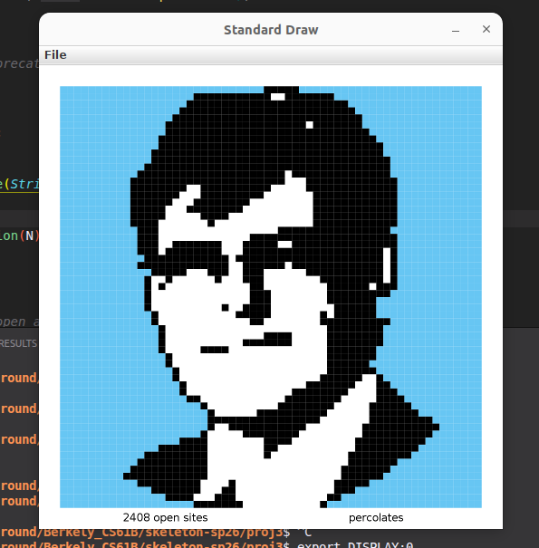

# Percolation (CS61B Project 3)

This repository contains a CS61B-style Percolation implementation and visualization tools.



## Project Structure

- `src/Percolation.java`: Percolation data type (your main implementation).
- `src/PercolationStats.java`: Monte Carlo simulation of the percolation threshold.
- `src/PercolationPicture.java`: Visualizes percolation using input files.
- `src/InteractivePercolationVisualizer.java`: Click-to-open interactive UI.
- `tests/PercolationTest.java`: JUnit tests (extend these with your own tests).
- `inputFiles/`: Example input sequences for the visualizer.

## Requirements

- Java (recommended: the version used by your CS61B setup)
- The Princeton `algs4` library on the classpath
- JUnit 5 (for running tests)

## Implementation Status

- Percolation uses two union-find structures to avoid backwash: one with virtual top/bottom for percolation checks, and one with virtual top only for fullness checks.
- `open` is idempotent; opening an already-open site is a no-op (useful for random sampling).
- Index validation is enforced in `open`, `isOpen`, and `isFull` (throws a `RuntimeException` on out-of-bounds indices).
- `PercolationStats` validates inputs (throws `IllegalArgumentException` when `N <= 0` or `T <= 0`).

## Build and Run

This project uses the default package (no `package` declarations). Use your usual CS61B
build setup or compile with `javac` and the appropriate classpath.

### Run the statistics demo

```bash
# From the project root
java PercolationStats
```

### Run the interactive visualizer

```bash
java InteractivePercolationVisualizer 10
```

### Run the file-based visualizer

```bash
java PercolationPicture inputFiles/input1.txt
```

## Behavior and Defaults

- `PercolationStats` performs Monte Carlo trials using random sites and reports mean, standard deviation, and 95% confidence interval.
- The `PercolationStats` `main` method uses `gridSize = 100` and `trials = 1000`.
- The interactive visualizer debounces mouse presses to avoid reopening the same cell while the button is held; releasing the mouse allows re-clicking a cell.

## Testing

Run JUnit tests from your IDE or with your preferred test runner. Start by extending
`tests/PercolationTest.java` with additional coverage (edge cases, percolation detection,
and fullness correctness).

## Notes

- Grid indices are zero-based (row 0, col 0 is top-left).
- `PercolationStats` expects `Percolation` to correctly implement `open`, `isOpen`,
  `isFull`, `numberOfOpenSites`, and `percolates`.

